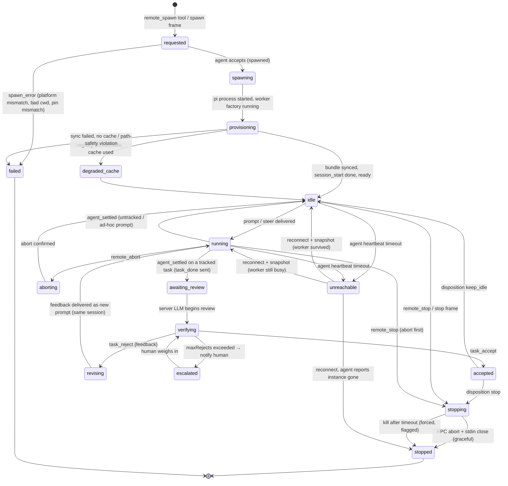
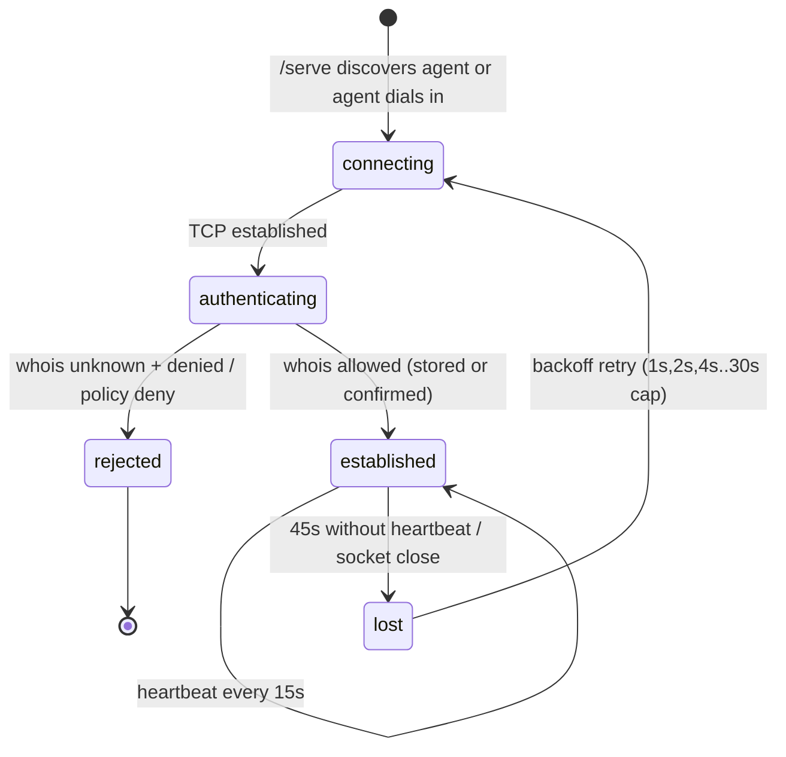
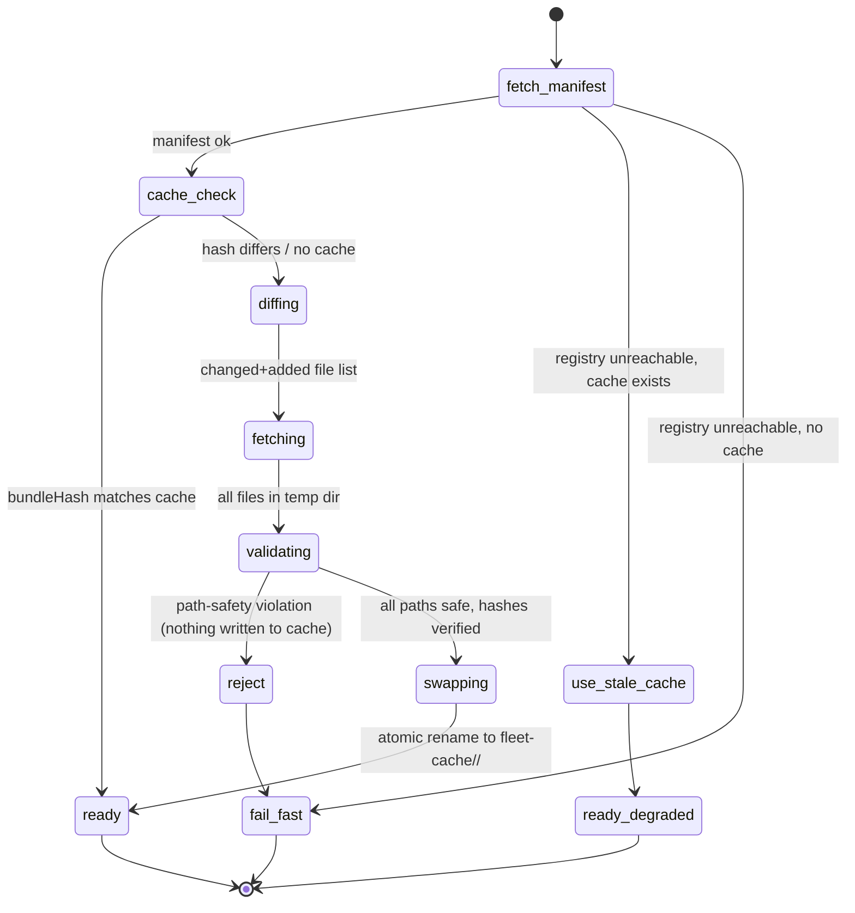
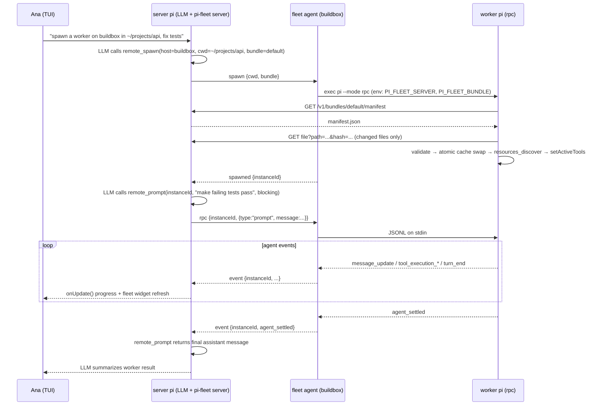
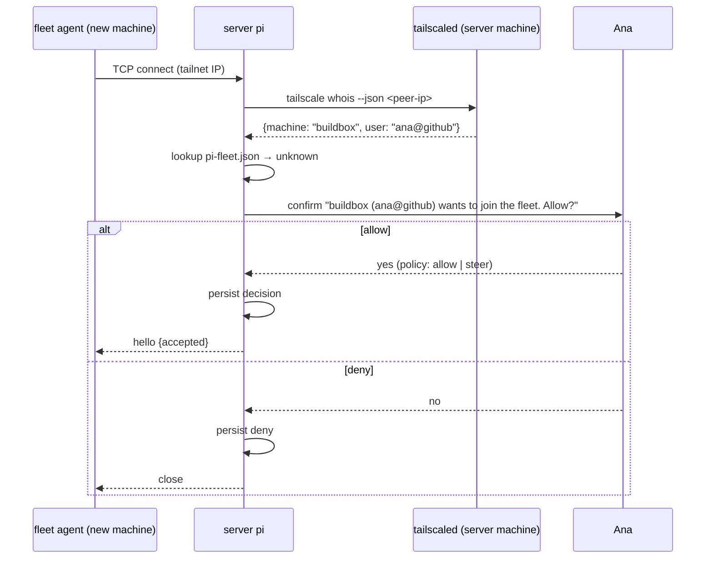
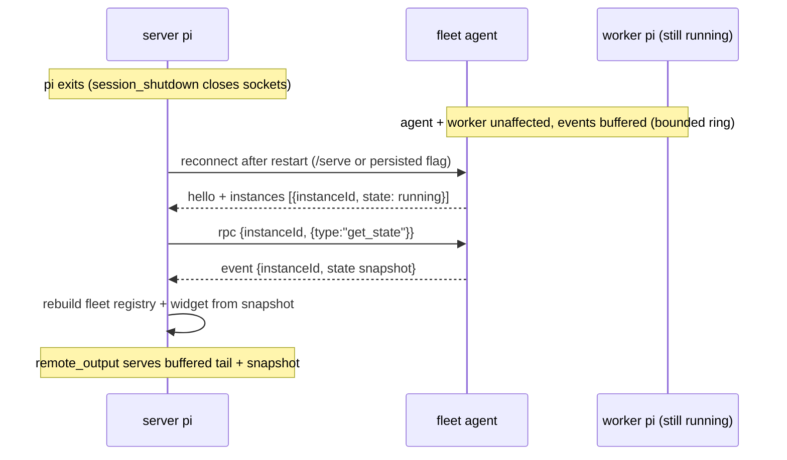
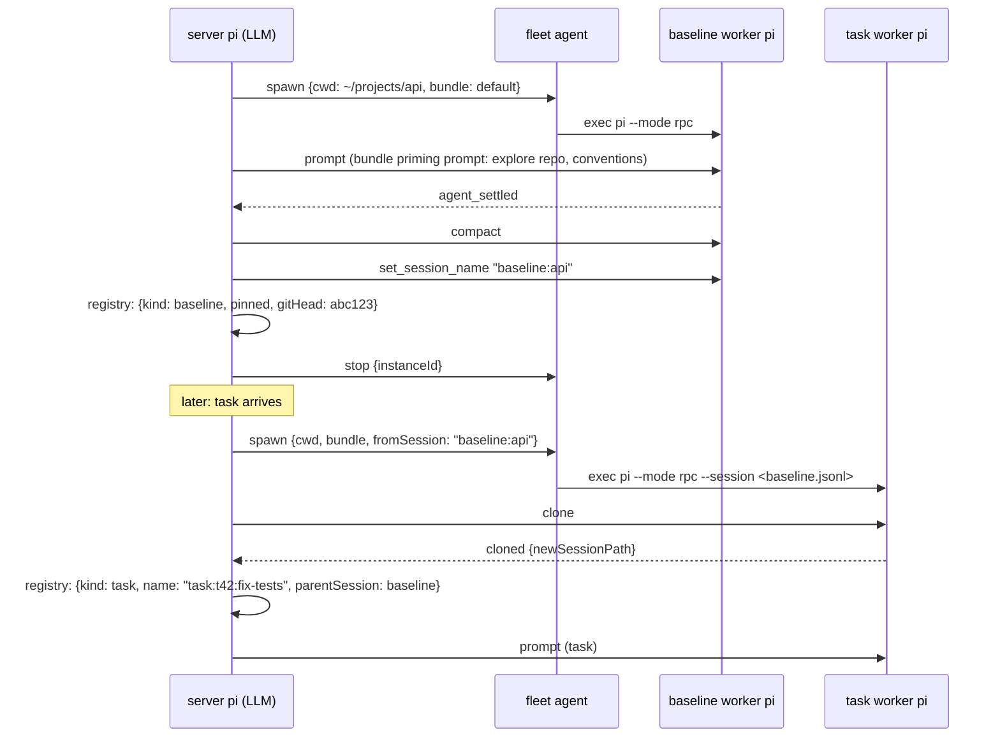
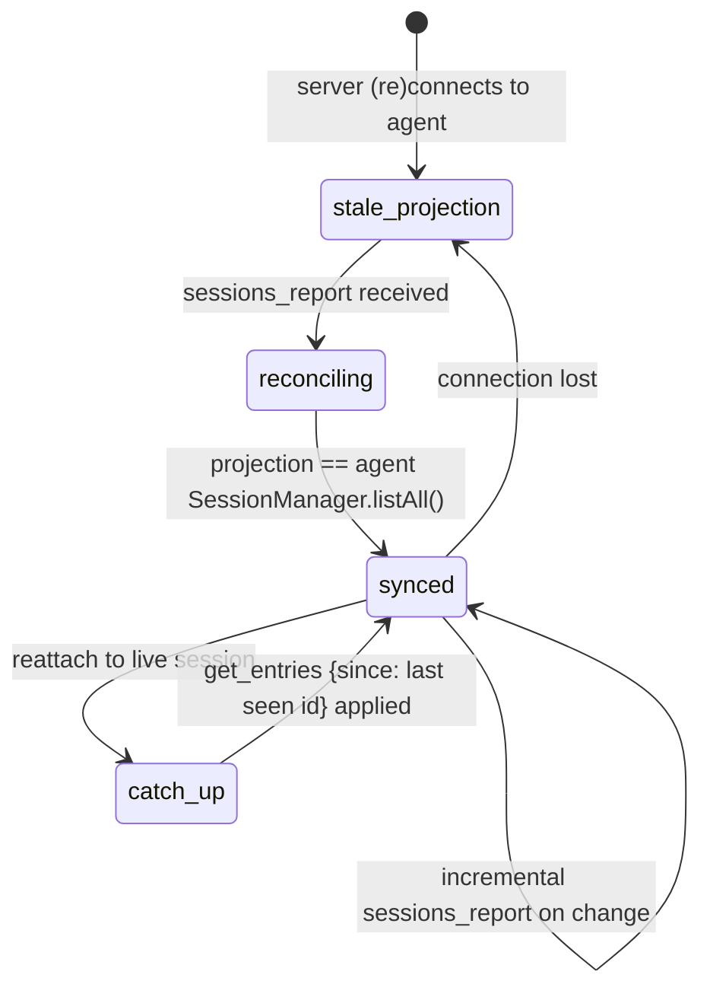
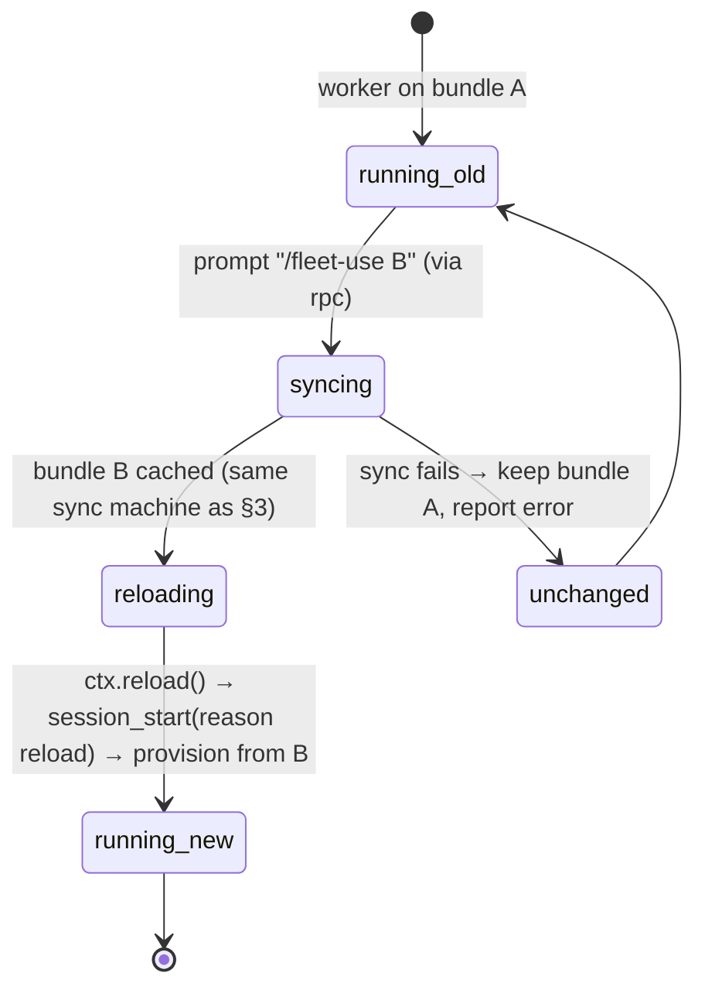

# State Flow

Authoritative state machines and sequence flows for pi-fleet. Frame names refer to [plan.md](plan.md) protocol v1.

## 1. Worker instance lifecycle (as tracked by the server)



Notes:
- `awaiting_review` keeps the worker process alive with its context intact, so `task_reject` revisions are cheap (no respawn, no re-provisioning).
- `unreachable` is a **server-side view state**: the worker itself keeps running under its agent. Reconciliation on reconnect trusts the agent's `instances` report.
- `degraded_cache` is surfaced in `fleet_status` and the widget; it clears on the next successful sync.

## 2. Server ⇄ agent connection lifecycle



## 3. Bundle sync (worker side)



## 4. Sequence: single-prompt delegation (Epic B1)



## 5. Sequence: first-contact trust (Epic E1)



## 6. Sequence: orchestrator restart + reattach (AC-3.5)



## 7. Sequence: task completion, ack, and verification

```mermaid
sequenceDiagram
    participant W as worker pi
    participant A as fleet agent
    participant O as agent outbox (disk)
    participant S as server pi (orchestrator LLM)
    participant U as Ana

    W-->>A: agent_settled (tracked taskId)
    A->>O: persist task_done {taskId, seq, summary, stats}
    A->>S: task_done
    alt server reachable
        S-->>A: task_done_ack
        A->>O: delete outbox entry
    else server offline / asleep
        Note over A,O: retry with backoff; replay on reconnect
        A->>S: task_done (replayed)
        S-->>A: task_done_ack (deduped by taskId+seq)
    end
    S->>S: sendMessage(fleet-task-done, triggerTurn: true)
    Note over S: worker state → awaiting_review
    S->>S: LLM wakes, reviews
    S->>A: rpc {instanceId, prompt: "run tests, show git diff --stat"}
    A->>W: JSONL stdin
    W-->>S: evidence (via event frames)
    alt work verified
        S->>A: task_accept {disposition}
        S-->>U: notify + widget: accepted
    else needs revision
        S->>A: task_reject {feedback}
        A->>W: feedback as new prompt (same session, context intact)
        Note over W: running again → next agent_settled starts a new review cycle
    else maxRejects exceeded
        S-->>U: notify: escalated, human review needed
    end
```

## 8. Sequence: baseline creation and clone-on-spawn



## 9. Session registry reconciliation



## 10. Runtime rebundle (`/fleet-use`, AC-4.1)



Session history is preserved across `reloading` because reload replays the same session file; only resources and tools change.
